# 延伸閱讀

[Chapter 8 資料基本處理| R 資料科學與統計](https://bookdown.org/jefflinmd38/r4biost/basictidy.html)

# 範例檔案下載

Dataset:[R做資料處理與分析](https://drive.google.com/drive/folders/1Y0FkK1By-cHIWSPmitLwYxKMiiUU5_jW?usp=sharing)

R script: [1110216 Breast cancer analysis.R](https://drive.google.com/file/d/1N_FUKbULaRtMAJFPZsjzJWCZ-WhyFSsV/view?usp=sharing)

本資料為一乳癌癌症資料登記檔，為去識別化資料，不得外流僅供課堂使用。

# 1.資料讀入與輸出

**[範例]**
```{r , eval=FALSE}
#安裝一次就好，之後就不需要再安裝
#如果沒有BiocManager要先下載
BiocManager::install("data.table")
BiocManager::install("writexl")
BiocManager::install("openxlsx")

#呼叫套件
library(data.table)
library(writexl)
library(openxlsx)

#設定工作路徑
#setwd("檔案存放路徑") #注意路徑要用\\或/

#\t tab
#\n new line
#cat("目前測試\ttab")
#cat("目前測試\ntab")


#檢查工作路徑設定
#getwd()

#讀入csv檔
dt=data.table::fread("範例檔案檔名.csv")

#讀入xlsx檔，第1個sheet
dt=openxlsx::read.xlsx("範例檔案檔名.xlsx",sheet=1)

#將表格資料輸出為csv檔
data.table::fwrite(dt,file="檔案名稱.csv")

#將表格資料輸出為xlsx檔
writexl::write_xlsx(dt,"檔案名稱.xlsx")

#建議於R操作的物件檔案都以RData做儲存為最佳
saveRDS(dt,file="1110208 dt.RData")

#讀入RData資料
dt=readRDS("1110208 dt.RData")
```


**[實戰操作]**

**1.請讀入範例資料檔案: ****[R做資料處理與分**析](https://drive.google.com/drive/folders/1Y0FkK1By-cHIWSPmitLwYxKMiiUU5_jW?usp=sharing)

**2.從第二列資料開始讀入**

```{r , eval=FALSE}
#setwd("設定資料存放路徑")
dt=openxlsx::read.xlsx("範例檔案檔名.xlsx",sheet=1,startRow=2)
```


# 2.資料查看

**[實戰操作]**
```{r , eval=FALSE}
#查看所有資料欄位的名稱與資料型態及內容
str(dt)

#查看前幾列的所有欄位資料
head(dt)


#指定看特定欄列位
dt[1,2] #查看第1列第2欄
dt[1:5,1:6] #查看第1-5列第1-6欄
dt[1:3,2:4] #查看第1-3列第2-4欄
dt[c(1,3,5),c(2:4,7)] #查看第1、3、5列第2-4、7欄
dt[,1:5] #查看第1-5欄的所有列資料
dt[1:5,] #查看第1-5列的所有欄資料
```


[課堂練習]

```{r , eval=FALSE}
#擷取Avg..Area.Income Avg..Area.Number.of.Rooms 欄位，2,4,5列資料
dt[c(2,4,5),c("Avg..Area.Income","Avg..Area.Number.of.Rooms")] 
```


# 3.建立自己的coding book

範例

| 欄位名       | 資料型態 | 數值     | 標籤                                            | 遺漏值定義 |
| ------------ | ---------- | ------- | --------------------------------------------- | ----------- |
| sex          | factor     | 1 0     | male female                                    | 9           |
| age          | numeric    | 1~100   |                                               | 999         |
| education    | factor     | 1 2 3 4 5 | elementary school junior high high school college graduate institute | 9           |
| ...          |            |         |                                               |             |


**coding book建立重點**

1.欄位名稱不能有空格->age group(X)  age-group(x) age_group(O)

2.欄位名稱不能以數字或標點符號開頭 ?myname 、 3sex

3.內容值要為數值，不要為文字

**資料型態:**

-連續變項(數值連貫，scale)->數值

-類別變項(性別、教育程度)->factor 因子

```{r , eval=FALSE}
#安裝一次就好，之後就不需要再安裝
#如果沒有BiocManager要先下載
BiocManager::install("codebook")
BiocManager::install("webshot")
BiocManager::install("rmarkdown")
BiocManager::install("future")

library(codebook)
library(webshot)
library(rmarkdown)
library(future)
webshot::install_phantomjs(force = TRUE)
codebook(mtcars) #產生mtcars的code book報告，會出現在viewer視窗->另存webpage
```


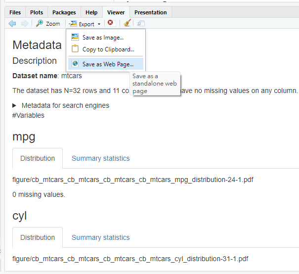

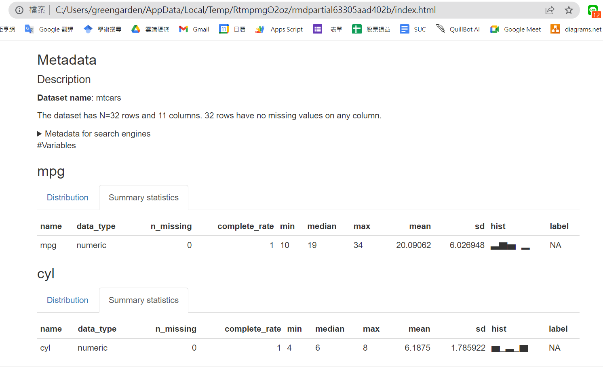

檔案會儲存在工作路徑下的figure資料夾裡

# 4.欄位重新命名

[範例]
```{r , eval=FALSE}
#以內建資料esoph為範例
#查看所有欄位名稱
names(esoph) 

#將欄位名稱alcgp改為alcohol_group
data.table::setnames(esoph,"alcgp","alcohol_group")

#將欄位名稱tobgp改為tobacco_group
data.table::setnames(esoph,"tobgp","tobacco_group")

#檢查欄位名稱修改結果
names(esoph) 

```

[課堂練習]

請將agegp欄位名稱改為age_group

```{r , eval=FALSE}
data.table::setnames(esoph,"agegp","age_group")

```


# 5.值重新編碼recode 

**[範例]**
```{r , eval=FALSE}


library(car)
#car::recode()
x <- rep(1:3, 3)
#  [1] 1 2 3 1 2 3 1 2 3

recode(x, "c(1,2)='A';else='B'")
#  [1] "A" "A" "B" "A" "A" "B" "A" "A" "B"

recode(x, "1:2 = 0")
#  [1] 0 0 3 0 0 3 0 0 3
#編碼有含上下界
recode(x,"lo:2=1;2:hi=2")
#[1] 1 1 2 1 1 2 1 1 2

y=c("grade1","grade2","grade3","grade4","grade5","grade6")
recode(y,"'grade1':'grade3'=1;'grade4':'grade6'=2")
# [1] 1 1 1 2 2 2
```

[實戰操作]
1.利用範例檔案將nerve_invasiveness欄位的7-9設定為NA(也就是遺漏值)

```{r , eval=FALSE}
#nerve_invasiveness
table(dt$nerve_invasiveness)
tmp=car::recode(dt$nerve_invasiveness,"7:9=NA") 
table(tmp) #檢查recode的結果
dt$nerve_invasiveness=tmp #將結果回傳原本欄位

```

# 6.遺漏值探勘與處理
教學網站:[Gallery of Missing Data Visualisations](https://cran.r-project.org/web/packages/naniar/vignettes/naniar-visualisation.html)

[範例]
```{r , eval=FALSE}
library(naniar)
#檢視欄位資料遺漏的占比
vis_miss(airquality)
```
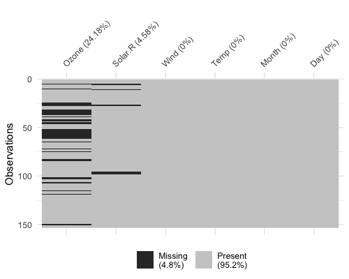

```{r , eval=FALSE}
miss_var_summary(airquality) #檢視每個欄位的missing rate</td>
```

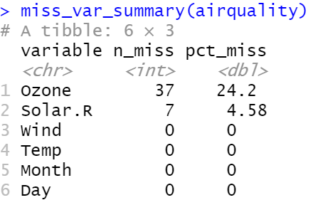
```{r , eval=FALSE}

#可以檢視欄位資料遺漏占比及各變項缺漏資料彼此間的關係
gg_miss_upset(airquality)
```

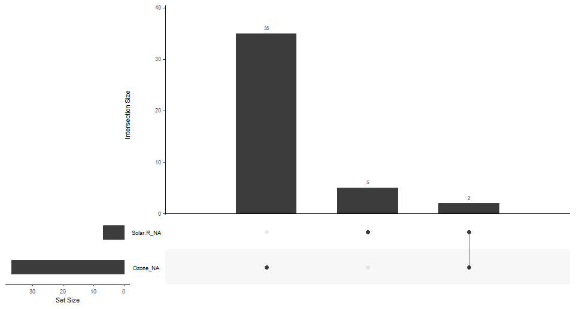
```{r , eval=FALSE}
gg_miss_var(linelist, show_pct = TRUE)

##意同下列
#gg_miss_var(airquality, show_pct = TRUE, facet = Month)

airquality %>% 
  gg_miss_var(show_pct = TRUE, facet = Month) 
```


延伸閱讀: [20 Missing data | The Epidemiologist R Handbook](https://epirhandbook.com/en/missing-data.html)

**[實戰操作]**

1.下載[BC data1.RData](https://drive.google.com/file/d/1hV8po1nyb0RGO15p9khCc8BTQVwlBQMV/view?usp=sharing)

2.利用vis_miss、gg_miss_upset檢查資料遺漏情形
```{r , eval=FALSE}
library(naniar)
#setwd("檔案儲存路徑")
#讀入的資料名稱為dt
load("BC data1.RData") #save(dt,"BC data1.RData")

#dt=readRDS("BC data1.RData")  #saveRDS(dt,"BC data1.RData") #建議方法

vis_miss(dt)
gg_miss_upset(dt)


#僅檢視1~20欄位
vis_miss(dt[,1:20])
gg_miss_upset(dt[,1:20])

#gg_miss_upset預設只能顯示5筆資料，若要顯示更多要設定參數
gg_miss_upset(dt,nsets = 20, nintersects = 20)
```

針對遺漏值會設定為NA，R才會自動辨識其為遺漏值(missing value)
```{r , eval=FALSE}


#每個階段對資料進行處理，會另存一個新物件，以利後續restore與偵錯
dt1=dt

#grade
table(dt1$grade)

class(dt1$grade) #檢查資料格式
dt1$grade=car::Recode(dt1$grade,"c(' ','9')=NA")  #missing value
table(dt1$grade)


#clinical_grade
table(dt1$clinical_grade)
dt1$clinical_grade=car::Recode(dt1$clinical_grade,"8=NA;9=NA")  #missing value
table(dt1$clinical_grade)

#pathological_grade
table(dt1$pathological_grade)
dt1$pathological_grade=car::recode(dt1$pathological_grade,"8=NA;9=NA")  #missing value
table(dt1$pathological_grade)
```

# 7.轉換資料格式、level label units設定

每個欄位資料必須設定其對應的資料屬性，後續的分析方能順利進行，在R的一般資料分析，大致上區分。

| 資料型態       | 範例                   | R轉換指令         |
| -------------- | ---------------------- | ------------------ |
| 數值(numeric)  | 身高、體重、年齡      |  as.numeric()     |
| 類別(factor)   | 學歷、婚姻狀態、是否得病 |  as.factor()      |
| 日期(date)     |                        |  as.POSIXct()     |


資料格式轉換步驟

1. 用table()或hist() 確認資料值均處理完畢，沒有錯誤值或離群值
2. 資料格式轉換
3. 確認轉換結果
4. 設定值的label及unit

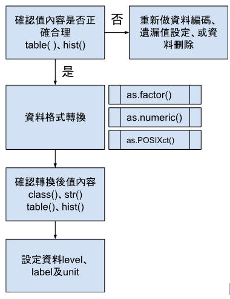

會使用到的範例檔欄位

| 欄位名           | 資料型態 | 數值                                                                                                              | 標籤      | 遺漏值定義 |
| ---------------- | -------- | ----------------------------------------------------------------------------------------------------------------- | --------- | ---------- |
| sex              | factor   | 1 男性<br>2 女性<br>3 其他，如：雙性人<br>4 變性人<br>9 不詳或病歷上未記載                                 | 性別      | 9          |
| birthday         | date     | 西元年日<br>20210215                                                                                            | 生日      |            |
| diagnosis_age    | numeric  |                                                                                                                   | 診斷年齡  |            |
| clinical_stage_1 | factor   | Stage 2E<br>Stage 3<br>Stage 3A<br>Stage 3A1<br>Stage 3A2<br>Stage 3B<br>Stage 3C<br>Stage 3C1<br>Stage 3C2<br>Stage 4<br>Stage 4A<br>Stage 4A1<br>Stage 4A2<br>Stage 4B<br>Stage 4C<br>Stage 888 不適用<br>Stage 999 不清楚或醫師未記錄<br>Stage BBB(僅適用AJCC第七、八版個案)<br>Stage OC：Occult cancer | 臨床分期  | 888<br>999<br>BBB |
| tumor_size       | numeric  |                                                                                                                   | 組織大小  |            |
| survival_status  | factor   | 0 死亡<br>1 存活                                                                                                 | 存活與否  |            |


```{r , eval=FALSE}


#3.資料格式轉換############################################
class(dt1$sex) #檢查原始的資料格式
dt1$sex=as.factor(dt1$sex)
class(dt1$sex) #檢查變更後的資料格式
table(dt1$sex)
dt1$birthday #檢查資料 
dt1$birthday=as.POSIXct(dt1$birthday, format="%Y%m%d", tz="UTC")

dt1$diagnosis_age=as.numeric(dt1$diagnosis_age)
hist(dt1$diagnosis_age)

dt1$clinical_stage_1=as.factor(dt1$clinical_stage_1)
table(dt1$clinical_stage_1)

dt1$tumor_size=as.numeric(dt1$tumor_size)
hist(dt1$tumor_size)

dt1$survival_status=as.factor(dt1$survival_status)
table(dt1$survival_status)

#設定欄位標籤，下面是示範用途，盡量不要用中文當標籤，若欄位名稱好辨識，也不需要設定label
library(Hmisc)
library(units)
label(dt1$sex)="性別"
label(dt1$birthday)="生日"
label(dt1$diagnosis_age)="診斷年齡"
label(dt1$clinical_stage_1)="分期"
label(dt1$tumor_size)="腫瘤大小"
label(dt1$survival_status)="存活狀態"


#類別欄位的值標籤設定
levels(dt1$sex)=c("Male","Female")
levels(dt1$survival_status)=c("death","survival")

#連續變項數值單位設定
units(dt1$tumor_size)="cm"
units(dt1$diagnosis_age)="year"

#檢查轉換後格式
str(dt1[,c("sex","birthday","diagnosis_age","clinical_stage_1","tumor_size","survival_status")])


#感受成果
library(table1)
##注意table1不能用units，所以先暫時把"tumor_size"省略
table1(~.,data=dt1[,c("sex","diagnosis_age","clinical_stage_1","survival_status")])
```


另一種批次資料label的方式
```{r , eval=FALSE}


library(expss)
data(mtcars)
mtcars = apply_labels(mtcars,
                      mpg = "Miles/(US) gallon",
                      cyl = "Number of cylinders",
                      disp = "Displacement (cu.in.)",
                      hp = "Gross horsepower",
                      drat = "Rear axle ratio",
                      wt = "Weight (1000 lbs)",
                      qsec = "1/4 mile time",
                      vs = "Engine", 
                      #上面是變項label下面是值label
                      vs = c("V-engine" = 0,
                             "Straight engine" = 1),
                      am = "Transmission",
                      am = c("Automatic" = 0,
                             "Manual"=1),
                      gear = "Number of forward gears",
                      carb = "Number of carburetors"
)
#convert to factor
mtcars$vs=as.factor(mtcars$vs)
mtcars$am=as.factor(mtcars$am)

table1(~.,data=mtcars)
```

[注意]
當使用labels或是units時，很有可能使用部分函式時會出現錯誤，這時就要用unlabel將資料的標籤去除掉。
```{r , eval=FALSE}


#移除欄位名稱label
library(labelled)
str(mtcars)
tmp=labelled::remove_labels(mtcars)
table1(~.,data=tmp)

#移除units
x <- 1
y <- set_units(x, m/s)
y

# this succeeds
drop_units(y)
set_units(y, NULL)
set_units(x, NULL)


df <- data.frame(x=x, y=y)
df
drop_units(df)
```


# 7.1 日期運算
```{r , eval=FALSE}


test1 <- as.POSIXct("2016-01-01", format="%Y-%m-%d", tz="UTC") 
test2 <- as.POSIXct("2016-01-02", format="%Y-%m-%d", tz="UTC") 
difftime(test2,test1, units="days")
difftime(test2,test1, units="weeks")
difftime(test2,test1, units="mins")
```
  
# 8.資料探勘

圖形探勘

| 變項           | 範例                    | 圖形類別       | 函式          |
| -------------- | ----------------------- | -------------- | ------------- |
| 1個類別         | 性別、教育程度         | bar chart      | `barplot()`   |
| 1個連續         | 身高、體重             | histogram      | `hist()`      |
| 1類別與1連續   | 性別*體重<br>性別*年齡 | boxplot        | `boxplot()`   |
| 2類別           | 性別*教育程度           | table          | `table()`     |
| 2連續           | 身高*體重               | scatter plot   | `plot()`      |


```{r , eval=FALSE}


#mtcars 為dplyr內建資料
library(dplyr)
freq=table(mtcars$carb) #先計算類別頻率

barplot(freq)
hist(mtcars$disp)
boxplot(mtcars$gear,mtcars$wt)
table(mtcars$am,mtcars$gear) #第一參數為列，第二個參數為欄
plot(mtcars$mpg ,mtcars$wt)

## summary
summary(Orange)
## create_report

library(DataExplorer)
# Create report
create_report(iris)
create_report(airquality, y = "Ozone")

## skim
install.packages("skimr")
library(skimr)
skim(Orange)
```
進階延伸閱讀:[Using Skimr](https://cran.r-project.org/web/packages/skimr/vignettes/skimr.html)

# 9.資料合併

cbind 欄位合併
```{r , eval=FALSE}
a=matrix(1:12, 3, 4)
b=matrix(-1:-12, 3, 4)
#欄位合併
x=cbind(a,b)
```

rbind 列位合併
```{r , eval=FALSE}
y=rbind(a,b)

```


merge()
```{r , eval=FALSE}
dt1 <- cbind(c("Tom", "Joe", "Vicky", "Bob"), c(27, 29, 28, 25))
dt2 <- cbind(c("Tom", "Joe", "Vicky", "Bruce"), c(178, 186, 168, 170))
colnames(dt1) <- c("name", "age")
colnames(dt2) <- c("name", "tall")
#取聯集
merge(dt1, dt2, by.x = "name", by.y = "name", all = T)


#以dt1的資料為主
merge(dt1, dt2, by.x = "name", by.y = "name", all.x = T)

#以dt2的資料為主
merge(dt1, dt2, by.x = "name", by.y = "name", all.y = T)

#取dt1 dt2的交集
merge(dt1, dt2, by.x = "name", by.y = "name")
```
  
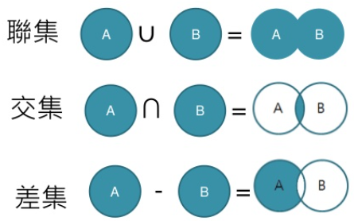

**[作業]將每位同學負責整理後的資料合併成一個檔案，併儲存為RData檔**

**提示:使用cbind()或merge()**
```{r, eval=FALSE}

dt1=load("dt1.RData")
dt2=load("dt2.RData")
dt3=load("dt3.RData")
dt4=load("dt4.RData")
dt5=load("dt5.RData")

dt1_1=dt1[,1:25]
dt2_1=dt2[,?]
dt3_1=dt3[,?]
dt4_1=dt4[,?]
dt5_1=dt5[,?]


#所有要確保所有資料不能排序，不能刪除任何一筆資料，不然無法合併
dt_All=cbind(dt1_1,dt2_1,dt3_1,dt4_1,dt5_1)

save(dt_All, file="dt_All.RData")

```


# 10. 描述性統計

Table 1延伸閱讀:
[https://cran.r-project.org/web/packages/table1/vignettes/table1-examples.html](https://cran.r-project.org/web/packages/table1/vignettes/table1-examples.html)

```{r , eval=FALSE}
library(boot)
library(table1)
melanoma2 <- melanoma

# Factor the basic variables that
# we're interested in
melanoma2$status <- 
  factor(melanoma2$status, 
         levels=c(2,1,3),
         labels=c("Alive", # Reference
                  "Melanoma death", 
                  "Non-melanoma death"))

melanoma2$sex <- 
  factor(melanoma2$sex, 
         levels=c(0,1),
         labels=c("Male","Female"))
melanoma2$ulcer <- 
  factor(melanoma2$ulcer, 
         levels=c(0,1),
         labels=c("No","Yes"))

table1(~ sex + age + ulcer + thickness | status, data=melanoma2)

table1(~ age + ulcer + thickness| sex*status, data=melanoma2)

table1(~ age + ulcer + thickness| status*sex, data=melanoma2)

```


[進階]

在Table 1加上P value
```{r , eval=FALSE}

pvalue <- function(x, ...) {
  #for table1()
  # Construct vectors of data y, and groups (strata) g

  y <- unlist(x)
  
  g <- factor(rep(1:length(x), times=sapply(x, length)))
  p=NULL #p value 
  if (is.numeric(y)) {
    # For numeric variables, perform a standard 2-sample t-test
    #p <- t.test(y ~ g)$p.value
    
    message("ANOVA............ \n")
    p<-tryCatch({
        tmp=aov(y ~ g)
        p=summary(tmp)[[1]][1,5]
        message("ANOVA and p = ",p,"\n")
        p  #don't use return, otherwise it will skip the next step
        },
        warning = function(w){
          message(w,"\n")
          tmp=aov(y ~ g)
          p=summary(tmp)[[1]][1,5]
          message("ANOVA and p = ",p,"\n")
          return(p)
        }
        ,
        error=function(e){
          message(e,"\n")
          message("ANOVA and p =NA \n")
         return(NULL)
      })
    
   
  
  }else{
    message("Chi-square............ \n")
    p<-tryCatch({
                p=chisq.test(table(y, g))$p.value
                message("Chi-aquare and p = ",p,"\n")
                p#don't use return, otherwise it will skip the next step
                },
               warning=function(w){
                 # message(w,"\n")
                 p=fisher.test(table(y, g), alternative = "two.sided",simulate.p.value=TRUE)$p.value
                 message("Fisher exact test and p = ",p,"\n")
                 return(p)
                 },
               error = function(e){
                 message("Error: ",e)
                 return(NULL)
                 })
    

  }

  
  if(is.numeric(p)){
    if(p<0.01){
      p <-formatC(p, format = "e", digits = 1)
    }else{
      p<-formatC(p, format = "fg",digits=2)
    }
  }else{
    p<-"NA"  #mean unable to compute
  }

  
  message("final p=",p,"\n")
  c(p)
}

table1(~ sex + age + ulcer + thickness | status, data=melanoma2,overall=F, extra.col=list(`P-value`=pvalue))
```

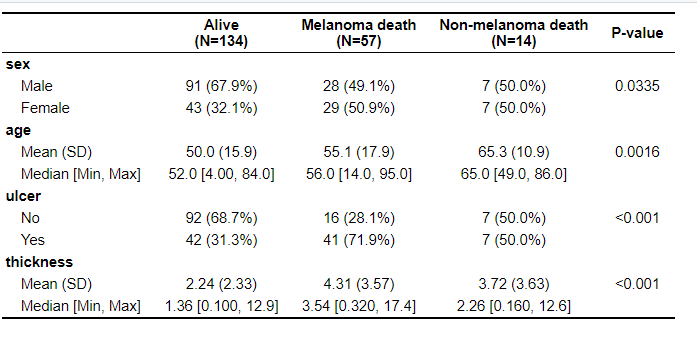

# 11.資料結構重構(reshape data)

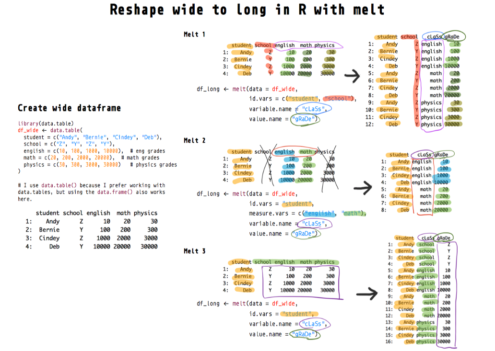

[Reshape R dataframes wide-to-long with melt — tutorial and visualization](https://towardsdatascience.com/reshape-r-dataframes-wide-to-long-with-melt-tutorial-and-visualization-ddf130cd9299)

# 12.基本單變項分析

先確認研究主題的自變項(independent variable)、依變項(dependent variable)，及共變項(covariates)

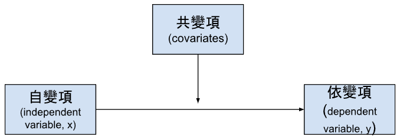

<table>
  <tr>
    <td>自變項</td>
    <td>依變項</td>
    <td>單變項分析方法</td>
  </tr>
  <tr>
    <td>類別</td>
    <td>類別</td>
    <td>卡方檢定
logistic regression</td>
  </tr>
  <tr>
    <td>類別
連續</td>
    <td>連續
類別</td>
    <td>t test (2組)
ANOVA(3組以上)
Simple linear regression (不限)</td>
  </tr>
  <tr>
    <td>連續</td>
    <td>連續</td>
    <td>linear regression
相關分析</td>
  </tr>
</table>


## chi-square(類別*類別)
```{r , eval=FALSE}
data("mtcars")
table(mtcars$carb, mtcars$cyl)    

chisq.test(mtcars$carb, mtcars$cyl)
chisq.test(mtcars$carb, mtcars$cyl)$expected
fisher.test(mtcars$carb, mtcars$cyl)
```

* 如果個別欄位的期望次數太低，會使機率分配無法近似於卡方分配。一般要求：自由度df>1時，期望次數小於5的欄位不多於總欄位的20%。

* 若自由度 df=1，且若期望次數 <10 ，則近似於卡方分配的假設不可信。此時可以將每個觀察值的離差減去 0.5 之後再做平方，這便是葉慈連續校正。

## Linear regression(連續*類別 或 連續*連續)
```{r , eval=FALSE}
fit=lm(wt~disp,data=mtcars)
summary(fit) # display results

fit=lm(wt~disp+am,data=mtcars)
summary(fit) # display results
```


[進階]如何用迴圈做多次單變項分析
```{r , eval=FALSE}
dv="wt" 
idvs=names(mtcars)
idvs=setdiff(idvs,dv)

out=NULL

for(idv in idvs){
  #idv="hp"
  #建立迴歸公式
  flm=formula(paste(dv,"~",idv))
  fit=lm(flm,data=mtcars)
  tmp=summary(fit)$coef
# tmp=summary(fit)$coefficients
# tmp=summary(fit)[["coefficients"]]

  out=rbind(out,tmp)
}

out=as.data.frame(out) #要先轉換成data.frame格式才可以儲存成xlsx
out$variable=row.names(out) #將列名稱儲存成新的欄位variable
#將資料輸出為xlsx檔
writexl::write_xlsx(out,"檔案名稱.xlsx")

```

[進階]去除分析結果的intercept，並只取p vlaue

```{r , eval=FALSE}

idx=grep("Intercept",row.names(out)) #回傳row name含有"Intercept"的列索引
out1=out[-idx,] #移除有"Intercept"的列資料
pv=out1[,4] #只保留第四欄位，也就是p值的資料
idx.pv<-pv<0.05
out1[idx.pv,]
out1[out1$`Pr(>|t|)`<0.05,]

```


## Logistic regression

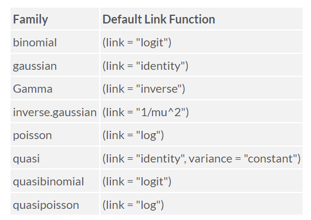
```{r , eval=FALSE}
fit <- glm(vs~wt+disp,data=mtcars,family=binomial())
summary(fit) # display results
confint(fit) # 95% CI for the coefficients
exp(coef(fit)) # 計算OR值 exponentiated coefficients
exp(confint(fit)) # 95% CI for exponentiated coefficients


#畫OR係數圖--------------------------
##取得model係數
coeff=as.data.frame(summary(fit)$coef) 
##建立變項欄位
coeff$term=row.names(coeff)
##計算OR值
coeff$OR=exp(coeff$Estimate)

library(ggplot2)
ggplot(coeff, aes(x = term, y = OR , fill = term)) + geom_col() + coord_flip()

```


## Correlation matrix
```{r , eval=FALSE}

library(GGally)
ggcorr(mtcars,
       nbreaks = 6,
       label = TRUE)

```

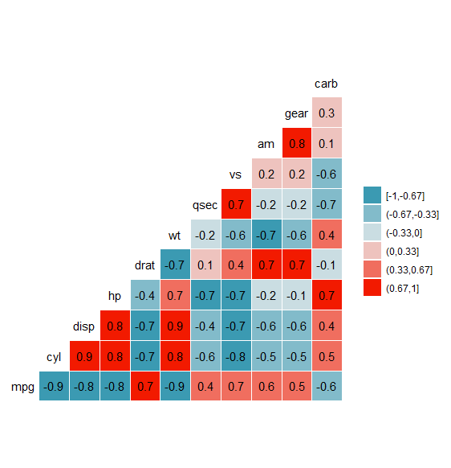
```{r , eval=FALSE}
ggpairs(mtcars)

```


# 13.多變項分析

[http://www.sthda.com/english/articles/36-classification-methods-essentials/150-stepwise-logistic-regression-essentials-in-r/](http://www.sthda.com/english/articles/36-classification-methods-essentials/150-stepwise-logistic-regression-essentials-in-r/)

## 多變項邏輯式迴歸
```{r , eval=FALSE}


##18.1多變項邏輯式迴歸
library(tidyverse)
library(caret)
library(mlbench)
library(dplyr)
# Load the data and remove NAs
data("PimaIndiansDiabetes2", package = "mlbench")
head(PimaIndiansDiabetes2)
dim(PimaIndiansDiabetes2) #768*9
PimaIndiansDiabetes2 <- na.omit(PimaIndiansDiabetes2)
dim(PimaIndiansDiabetes2) #392*9

# Inspect the data 
sample_n(PimaIndiansDiabetes2, 3)

# Split the data into training and test set
set.seed(123)

##sampling training set
training.samples <- PimaIndiansDiabetes2$diabetes %>% 
  caret::createDataPartition(p = 0.8, list = FALSE)
#training set data row indice
training.samples
train.data  <- PimaIndiansDiabetes2[training.samples, ]

#testing set
test.data <- PimaIndiansDiabetes2[-training.samples, ]

library(MASS)
# Fit the model
step.model <- glm(diabetes ~., 
                  data = train.data, 
                  family = binomial) %>%
  stepAIC(trace = FALSE)

step.model2 <- glm(diabetes ~glucose+mass+pedigree, 
                  data = train.data, 
                  family = binomial) %>%
  stepAIC(trace = FALSE)


# Summarize the final selected model
summary(step.model) #AIC: 279.79，AIC小比較好
summary(step.model2) #AIC: 290.64

# Make predictions
probabilities.step <- step.model %>% 
  predict(test.data, type = "response")

predicted.classes <- ifelse(probabilities.step > 0.8, 
                            "pos", "neg")
predicted.classes


#比較真實與預測結果的落差，去調整機率切點值
res = data.frame(tr = test.data$diabetes,
                 pred = predicted.classes,
                 prob = probabilities.step)
head(res)


#觀察有糖尿病患者的預測機率值
ggplot(res, aes(x = prob, fill = tr, colour = tr)) + 
  geom_histogram(alpha = 0.5, position = "identity") + 
  theme(legend.position = "right")  

# Model accuracy
mean(predicted.classes==test.data$diabetes) #0.5->0.7820


full.model <- glm(diabetes ~., data = train.data, family = binomial)
#取出所有model的變項係數
out=coef(full.model)
out=as.data.frame(out)
out=data.frame(rownames=row.names(out),
               coef=out)
out
writexl::write_xlsx(out,"LG coef.xlsx")

#自訂model
my.model=glm(diabetes~glucose+mass+pedigree,data=train.data,family=binomial)


# Make predictions
probabilities.full <- full.model %>% predict(test.data, type = "response")
predicted.full.classes <- ifelse(probabilities.full > 0.5, "pos", "neg")

# Prediction accuracy
observed.classes <- test.data$diabetes
mean(predicted.full.classes == observed.classes) #0.75

#ROC curve
library(ROCit)
ROCit_obj <- rocit(score=probabilities.step,
                   class=observed.classes)
plot(ROCit_obj)

ROCit_obj <- rocit(score= probabilities.full,
                   class=observed.classes)
plot(ROCit_obj)

#找最佳切點 Youden Index = sen - (1-spe)

#將兩個ROC疊圖
library(pROC)
roc1 <- plot.roc(observed.classes, 
                 probabilities.full, 
                 main="ROC comparison", 
                 percent=TRUE, 
                 col= "red")
roc2 <- lines.roc(observed.classes, 
                  probabilities.step, 
                  percent=TRUE, 
                  col="blue")
```

## 多變項線性迴歸

demo data:[USA_Housing.csv](https://drive.google.com/file/d/1XrsakcG5yVjHaZIefR2aZA0WdKPchBs2/view?usp=sharing)

[https://www.r-bloggers.com/2020/05/step-by-step-guide-on-how-to-build-linear-regression-in-r-with-code/](https://www.r-bloggers.com/2020/05/step-by-step-guide-on-how-to-build-linear-regression-in-r-with-code/)

```{r , eval=FALSE}


# Reading data
#setwd("D:\\greengarden\\1110209 Breast cancer")
housing <- read.csv("USA_Housing.csv",
                    header = TRUE, 
                    sep = ",")
# Print top 6 observations
head(housing)


library(ggplot2)
# Building histogram
ggplot(data=housing, aes(housing$Price)) +
  geom_histogram(aes(y =..density..), fill = "orange") +
  geom_density()

#檢查依變項是否符合常態分佈，linear regression的假設

# 資料的描述性統計
library(psych)
psych::describe(housing)

#資料結構重建
library(reshape2)
meltData <- melt(housing)
head(meltData)

#畫boxplot 檢查outliers
p <- ggplot(meltData, aes(factor(variable), value))
p + geom_boxplot() + facet_wrap(~variable, scale="free")

#Apart from Area of Number of Bedrooms all other variables seem to have outliers

require(corrgram)
corrgram(housing, order=TRUE)

#檢查自變項之間不要有高度相關，避免共線性問題，若有高度相關只取比較重要的變項進入模型
#資料切分為訓練及測試組
library(caret)
# Split data into train and test
index <- createDataPartition(housing$Price, p = .70, list = FALSE)
train <- housing[index, -7] #delete 7th column Address
test <- housing[-index, -7]
# Checking the dim of train
dim(train) #3500*6

# Taining model
lmModel <- lm(Price ~ . , data = train)
# Printing the model object
print(lmModel)


# Checking model statistics
summary(lmModel)

#整體模型預測好壞指標，越小越好
# Using AIC function
AIC(lmModel) 
# Using BIC function
BIC(lmModel)

# Checking model object for actual and predicted values
names(lmModel)
library(Metrics)

#Root Mean Square Error(RMSE)，越小越好，表示預測的錯誤越少
rmse(actual = train$Price, 
     predicted = lmModel$fitted.values) #100804.1

# Histogram to check the distribution of errors
df=data.frame(rs=lmModel$residuals)
ggplot(df, aes(x=rs)) + 
  geom_histogram()

#符合linear regression假設殘差要符合常態分佈
# Using plot function
# Using plot function
plot(lmModel)

#符合linear regression假設殘差要符合常態分佈
#A straight red line closer to the zero value represents that we do not have heteroscedasticity problems in our data.

#自變項共線性問題診斷
library(fmsb)
vif_func<-function(in_frame,thresh=10,trace=T,...){
  
  library(fmsb)
  
  if(any(!'data.frame' %in% class(in_frame))) in_frame<-data.frame(in_frame)
  
  #get initial vif value for all comparisons of variables
  vif_init<-NULL
  var_names <- names(in_frame)
  for(val in var_names){
    regressors <- var_names[-which(var_names == val)]
    form <- paste(regressors, collapse = '+')
    form_in <- formula(paste(val, '~', form))
    vif_init<-rbind(vif_init, c(val, VIF(lm(form_in, data = in_frame, ...))))
  }
  vif_max<-max(as.numeric(vif_init[,2]), na.rm = TRUE)
  
  if(vif_max < thresh){
    if(trace==T){ #print output of each iteration
      prmatrix(vif_init,collab=c('var','vif'),rowlab=rep('',nrow(vif_init)),quote=F)
      cat('\n')
      cat(paste('All variables have VIF < ', thresh,', max VIF ',round(vif_max,2), sep=''),'\n\n')
    }
    return(var_names)
  }
  else{
    
    in_dat<-in_frame
    
    #backwards selection of explanatory variables, stops when all VIF values are below 'thresh'
    while(vif_max >= thresh){
      
      vif_vals<-NULL
      var_names <- names(in_dat)
      
      for(val in var_names){
        regressors <- var_names[-which(var_names == val)]
        form <- paste(regressors, collapse = '+')
        form_in <- formula(paste(val, '~', form))
        vif_add<-VIF(lm(form_in, data = in_dat, ...))
        vif_vals<-rbind(vif_vals,c(val,vif_add))
      }
      max_row<-which(vif_vals[,2] == max(as.numeric(vif_vals[,2]), na.rm = TRUE))[1]
      
      vif_max<-as.numeric(vif_vals[max_row,2])
      
      if(vif_max<thresh) break
      
      if(trace==T){ #print output of each iteration
        prmatrix(vif_vals,collab=c('var','vif'),rowlab=rep('',nrow(vif_vals)),quote=F)
        cat('\n')
        cat('removed: ',vif_vals[max_row,1],vif_max,'\n\n')
        flush.console()
      }
      
      in_dat<-in_dat[,!names(in_dat) %in% vif_vals[max_row,1]]
      
    }
    
    return(names(in_dat))
    
  }
  
}


#檢查變項共線性
vif_func(housing[, 1:5])

#VIF小於10沒有共線性問題

#新增一個test欄位跟Avg..Area.Income呈現完全正相關，展示VIF>10的狀況
housing$test=housing$Avg..Area.Income*1.5
vif_func(housing[, c(1:5,8)])


#檢查殘差為隨機分布
library("lmtest")
dwtest(lmModel)
#We got a value of 1.9867 which suggests that there is no auto serial correlation.
# Predicting Price in test dataset
test$PreditedPrice <- predict(lmModel, test)
# Priting top 6 rows of actual and predited price
head(test[ , c("Price", "PreditedPrice")])
#計算model R square
actual <- test$Price
preds <- test$PreditedPrice
#residual sum of squares 殘差平方和，測不準的地方
rss <- sum((preds - actual) ^ 2)
tss <- sum((actual - mean(actual)) ^ 2)
rsq <- 1 - rss/tss
rsq
```

**_Our model is performing fantastic_****.**
*In the test dataset, we got an accuracy of 0.9140436 and a training data set, we got an accuracy of 0.918*.

[說明]

**1. AIC and BIC values** – The AIC(Akaike’s information criterion, 1974) and BIC(Bayesian information criterion, 1978) are penalized-likelihood criteria. Both these measures use a "measure of fit + complexity penalty" to get the final values.

**AIC = – 2 * ln(likelihood) + 2 * p**

**BIC = – 2 * ln(likelihood) + ln(N) * p**

Here p = number of estimated parameters and N = sample size.

The AIC and BIC values can be used for choosing the best predictor subsets in regression and for comparing different models. When comparing different models, the model with minimum AIC and BIC values is considered the best model.

**2. There should be no multicollinearity **– The linear model assumes that the predictor variables do not correlate with each other. If they exhibit high correlation, it is a problem and is called **multicollinearity**. A variation inflation factor test can help check for the multicollinearity assumption.

VIF = 1/(1-R2)

**3. There should be no auto serial correlation** – The autocorrelation means that error terms should not be correlated with each other. To check this, we can run the Durbin-Watson test(dw test). The test returns a value between 0 and 4. If the value is two, we say there is no auto serial correlation. However, a value higher than 2 represents (-) ve correlation and value lower than 2 represents (+) ve correlation.

# 14.machine learning

[https://www.edureka.co/blog/naive-bayes-in-r/](https://www.edureka.co/blog/naive-bayes-in-r/)

# 15.補充

[Train, Test, & Validation Sets explained](https://www.youtube.com/watch?v=Zi-0rlM4RDs)

